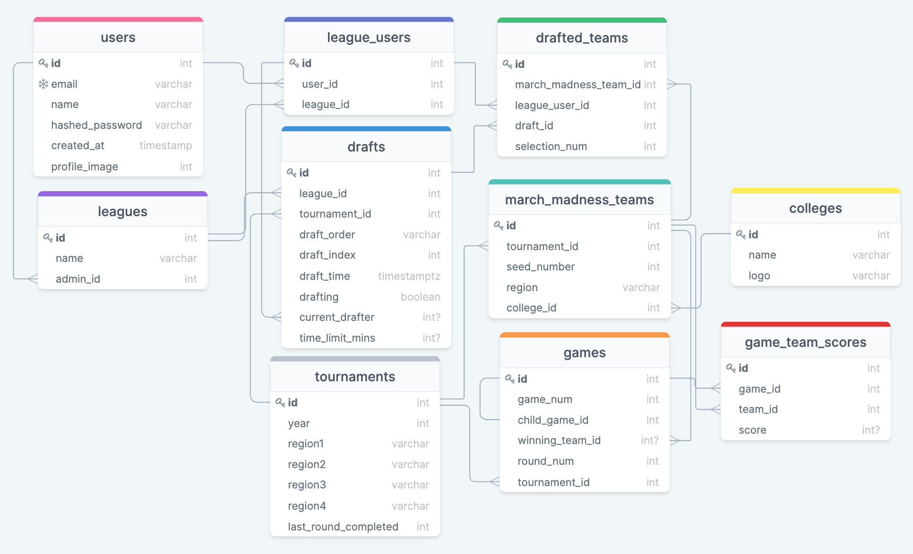

# MVP FEATURES
- Leagues
- Games
- Users
  - League admin
  - Regular
- Teams
- Live Draft
- Round by Round Bracket Visualization
- Round by Round Points Visualization

# STRETCH FEATURES
- Vegas odds
- User icons
- Team logos
- Email invitations

# SCHEMA

# BACKEND ENDPOINTS
- POST /api/auth/login
- GET /api/auth/logout
- POST /api/auth/signup
- POST /api/users/:id/leagues
  - Create a league
- POST /api/users/:id/leagues/:id/league-user
  - Add a user to the league
- POST /api/users/:id/leagues/:id/games
  - Create a new game
- POST /api/users/:id/leagues/:id/games/:id/drafted-teams
  - On success:
    - Adds drafted team
    - Updates the games: 
      - available_team_ids
      - draft_index
      - current_drafter
    - Emits an event to the sockets with updated draft data
      - available_team_ids
      - draft_index
      - current_drafter
- SOCKETS
  - During a draft for a specific game

# FRONTEND ROUTES
- /
  - login and signup accessible from a button on splash page
- /users/:id/create-league
- /users/:id/leagues/:id/create-game
- /users/:id/leagues/:id/games/:id/bracket
  - Displays the bracket visualization for the specific game
- /users/:id/leagues/:id/games/:id/leaderboard
  - Displays the leaderboard for the specific game
- /users/:id/leagues/:id/games/:id/draft
  - Displays the draft page
